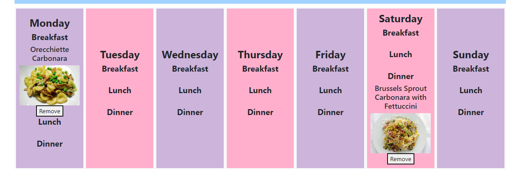

# whats-for-tea
## Description

What's For Tea!? is a one stop application for organising your evening meals. The user can search by meal name to find ingredients, search by the available ingredients in their house to get suggestions on what to make, and then add the resulting meals to a mealplan to plan their week ahead. This app was built with HTML, CSS, JavaScript, jQuery, BootStrap, and the Spoonacular recipe API.

## Deployed Application:

Please enjoy the deployed application here: https://callumquirky.github.io/whats-for-tea/

# Features

## What do I need?

The user can input the meal the user wants to make, and the page will return a list of available options. 

Choose the one that looks best and view the list of ingredients!

## What to Make?

The user can search by the ingredients available in their house to get suggestions if they're stumped on what to make for dinner or fancy some inspiration! The user can add filters to this search depending if they want a breakfast, main course, or dessert and filter by various diet and intolerance options to get suggested meals that work for them.

 The user can click on the returned meal's to add it to the 'What do I need?' section to see the rest of the ingredients of the recipe.

## Meal Plan

The user can add the meals that are genarated to a meal plan, so that they can plan their week ahead.

Each meal comes with a button to add to meal plan, that opens a menu for the user:

There is functionality that prevents the user from creating duplicate meals for specific time slots. 

After clicking save, the meal is added to a meal plan at the desired location:

## Error Reporting

If the user's search term is empty or doesn't yield any results from the Spoonacular API, then the page returns one of two errors:

Search term empty:

Search term no results:

# License

This project uses an MIT license.